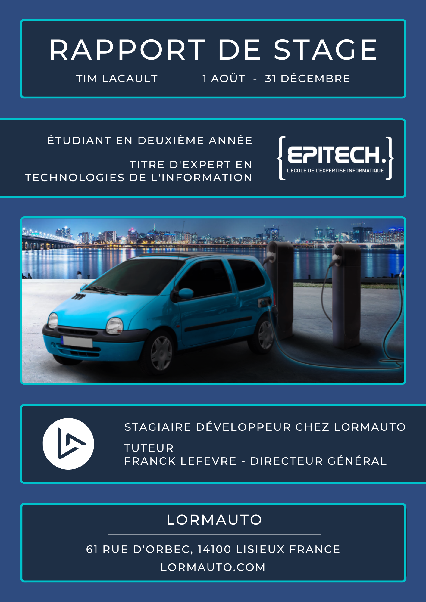

<!-- PROJECT LOGO -->
<br />
<p align="center">
  <a href="https://github.com/TLacault">
    
  </a>

  <h2 align="center">README</h2>
  <h3 align="center">INTERSHIP REPORT</h3>

</p>


<!-- TABLE OF CONTENTS -->
<details open="open">
  <summary><strong>Table of Contents</strong></summary>
    <strong>
      <ol>
        <li><a href="#internship-report">Internship Report</a></li>
        <li><a href="#project-description">Project Description</a></li>
        <li><a href="#grades-for-this-project">Grades For This Project</a></li>
        <li><a href="#clone-the-repository">Clone The Repository</a></li>
        <li><a href="#contact">Contact</a></li>
      </ol>
  </strong>
</details>


<!-- Internship Report -->
## Internship Report
<p align="center">
    <a href="https://github.com/TLacault">
        
    </a>
</p>

* <strong>See the full internship report here : [PDF](https://github.com/TLacault/internship/blob/main/internship_report.pdf)</strong>
* <strong>Or download it here : [DOWNLOAD](https://github.com/TLacault/internship/raw/main/internship_report.pdf)</strong>

<br />

<!-- Project Description -->
## Project Description

* <strong>The objective of your work experience cycles is to develop both your technical skills, social skills and your
allround relational fluency.
You are expected to develop your leadership skills through aptitudes such as curiosity, adaptability, listening skills, empathy, consideration, and motivation.</strong>

* <strong>See the full project description here : [PDF](https://github.com/TLacault/internship/blob/main/project_description.pdf)</strong>
* <strong>Or download it here : [DOWNLOAD](https://github.com/TLacault/internship/raw/main/project_description.pdf)</strong>

<br />

<!-- Grades For This Project -->
## Grades For This Project

* <strong>Internship Report : 19</strong>
* <strong>Company Rating : 18.67</strong>
* <strong>Oral Presentation : 17</strong>

<!-- Clone The Repository -->
## Clone The Repository

* <strong>Clone with HTML</strong>
   ```sh
   git clone https://github.com/TLacault/internship.git
   ```

* <strong>Clone with SSH</strong>
   ```sh
   git clone git@github.com:TLacault/internship.git
   ```

<!-- Contact -->
## Contact

* <strong>Mail Perso - lacault.tim@gmail.com</strong>
* <strong>Mail Pro - contact@dev-tlacault.eu</strong>
* <strong>Mail Université - tim.lacault@etu.u-bordeaux.fr</strong>

* <strong>Project Link : </strong>[Intership](https://github.com/TLacault/internship)
